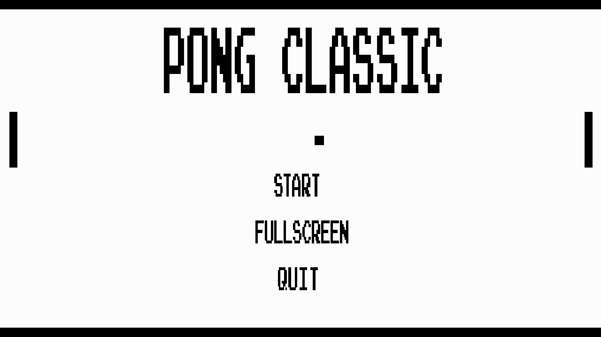
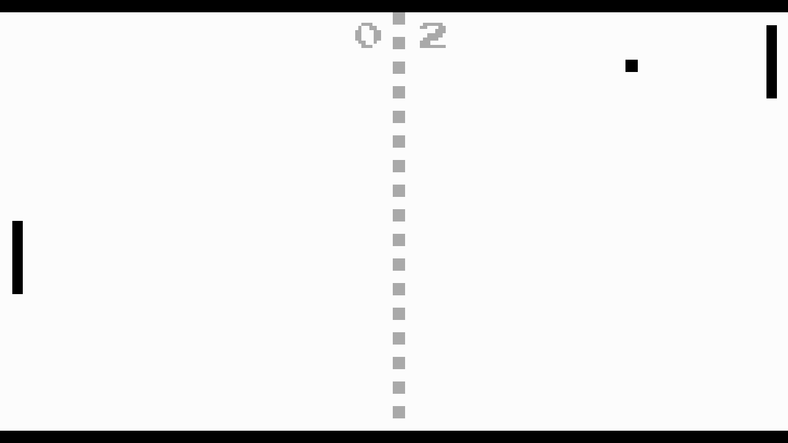
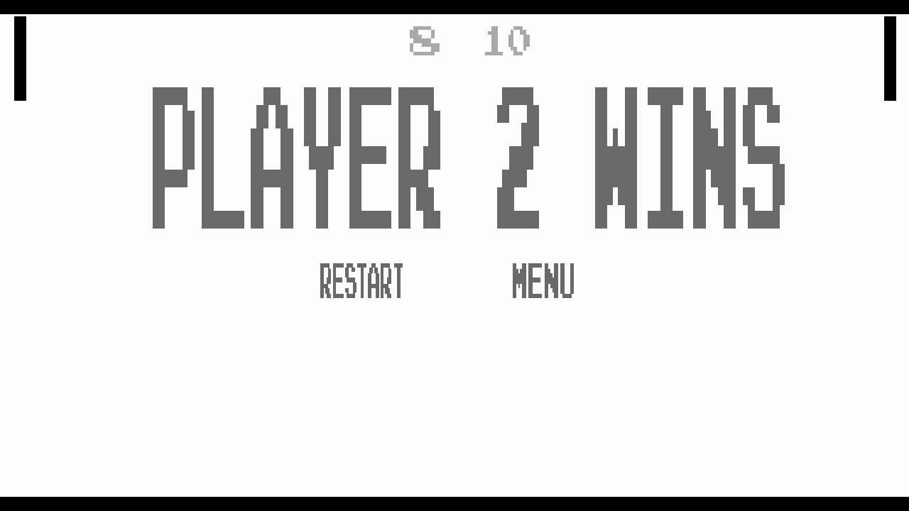

# Pong-Classic

A recreation of the game Pong, made in Python using SDL2. Since the game is "classic" pong,
currently it is only the two player version. In order to control the game, player 1 uses the
'W' and 'S' keys to move up and down, while player 2 uses the 'UP' and 'DOWN' arrow keys to move.

Use the 'P' key to pause while in-game.

## TODOS
* Work on implementing controller support, so that players can move with gamepads.
* implement paddle acceleration using mouse or joystick
* (possibly) implement a CPU vs mode.

## Screenshots

* 

* 
